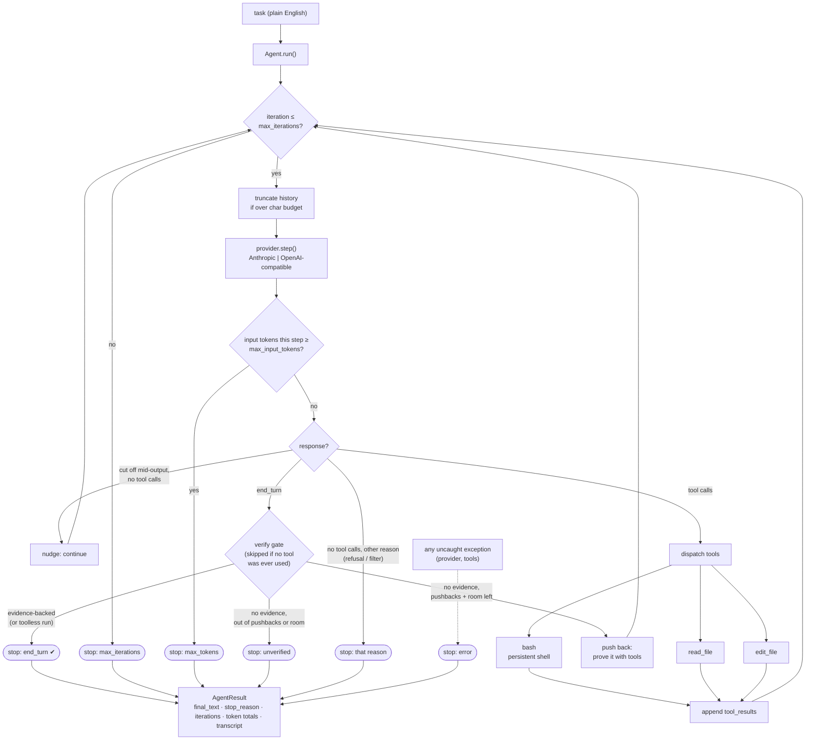

# mini-gt-swe — GroundTruth × mini-swe-agent

> **mini-gt-swe** modifies mini-swe-agent to use GroundTruth's deterministic
> context inside the agent loop. GroundTruth is the deterministic evidence engine
> inside that loop—not an after-the-fact trace annotator.**

This repository embeds **GroundTruth (GT)** — a deterministic, LLM-free codebase-evidence
engine — inside the modified mini-swe-agent loop. GT pre-computes a complete call graph of the
task repository (tree-sitter AST parsing via the Go `gt-index` binary) and appends verified
structural facts (definitions, caller contracts, signature deltas, covering tests, recovery
guidance) directly into the tool observations the model already reads — at most one evidence
dose per observation, append-only, sealed with a hash chain, and silent when it has nothing
verified to say.

The integration lives in `gt_engine/` (bridge, indexer, evidence-aware context management,
advisory verify gate) plus the lifecycle boundaries in `nano/agent.py`. A GT-enabled request
therefore follows a deterministic coding SDLC:

1. **Ideate/plan:** task-start obligations and ranked localization are inserted before the
   first model decision.
2. **Code:** pre-edit, edit, and post-edit observations are normalized through the GT gateway;
   applicable structural facts compete under the one-dose law.
3. **Verify/test:** executed syntax, covering-test, and observed-RED evidence update the
   completion decision; unavailable evidence is named and fails open.
4. **Penultimate submit check:** every GT-enabled completion is probed before acceptance.
   Positive failing evidence can refuse once; the second attempt cannot deadlock.
5. **Proof:** `gt_ledger.jsonl` proves sealed delivery bytes, while the hash-chained
   `gt_attribution.jsonl` records all 17 mechanisms as witnessed, dark, suppressed, faulted,
   or ineligible. Provider-request block lists—not trajectories—prove exposure to the next
   model response, whose resulting tool-call IDs/names are linked to those delivery IDs.
   Raw model text and tool arguments are never persisted. Exposure is not mislabeled as
   semantic consumption or causal benefit; a controlled GT-off baseline supplies the
   behavior/reward delta.

**With GT disabled
(no `--gt-root`), this harness preserves the stock mini-swe-agent path** — that property is
enforced by tests, and it is what makes clean GT-on vs. GT-off benchmark comparisons possible.

The base agent loop comes from mini-swe-agent. mini-gt-swe modifies it to inject
GroundTruth deterministic context while preserving a GT-off comparison path.

---

# mini-gt-swe


> Smallest readable coding-agent loop that scores on benchmarks.

mini-gt-swe is a modified mini-swe-agent **coding agent** — the code that wraps an
LLM and turns it into something that completes real work in a repository (a loop,
a small tool set, context management, and a system prompt). It is built to score
on agentic coding benchmarks (Terminal-Bench and SWE-bench Verified) while staying
tiny enough to read end-to-end in one sitting: **~970 non-blank lines** across five
files in `nano/`.

The design philosophy is the Karpathy "nano" aesthetic (nanoGPT, nanochat) applied
to agent harnesses: small, legible, no premature abstraction. The differentiator is
**score-per-line-of-code** — most popular harnesses compete on features and never
publish benchmark numbers; mini-gt-swe aims to be a tiny harness with reproducible,
published scores.

> ### ⚠️ Security: this runs model-generated commands with your full privileges
>
> The `bash` tool executes whatever the model emits — in your shell, as your user,
> with your environment, your filesystem, and your network. There is **no sandbox,
> no allow-list, and no workspace jail.** A prompt-injected or mistaken command can
> read your credentials, delete files, or make network calls.
>
> **Run it inside a disposable container** (the benchmark adapter already does this —
> every task runs in its own Docker container). Do **not** point it at a checkout on
> a workstation that holds secrets or anything you can't afford to lose.

## What this is

An agent harness for coding tasks. You give it a plain-English task inside a working
repository; it reads code, runs commands, edits files, runs tests, and reports back.

## What this is NOT

- **Not a general agent framework** — no plugin system, no extensibility for arbitrary
  domains.
- **Not a product with a UI** — no dashboard, no auth, no SaaS. The only surface is a CLI.
- **Not a chat assistant** — it is task-completion-focused, not conversational.

## Features

- **Reactive native-tool-use loop.** Uses the model provider's native tool-calling API
  directly (no ReAct text prompting). The model self-corrects step by step until it
  ends its turn or hits a budget limit.
- **Three tools, that's it.** `bash` (persistent shell), `read_file` (line-sliced
  reads), `edit_file` (unique-match string replace / file create). `bash` subsumes
  `ls`, `grep`, build, test, and install.
- **Provider-agnostic.** Ships with an Anthropic provider and an OpenAI provider behind
  one `Provider` protocol. The OpenAI provider also targets any OpenAI-compatible server
  (vLLM, Ollama, llama.cpp, Together) via `--base-url`.
- **Prompt caching.** The Anthropic provider marks the system prompt and the most recent
  user turn with `cache_control: ephemeral` — a meaningful cost win on long benchmark runs.
- **Context management.** Hard caps on iterations and input tokens, plus automatic
  truncation of the oldest `tool_result` blocks when the message history exceeds a
  character budget (keeps the message + tool-call id, drops the bulky content).
- **Persistent shell.** A single long-lived shell process preserves cwd, env, and shell
  state across `bash` calls; commands run with a per-call timeout that kills the whole
  process tree and respawns the shell on hang. A nonzero exit status is surfaced to the
  model as an error (a failing test can't be mistaken for a passing one). Uses `bash`
  everywhere it exists — including Windows via Git Bash; `cmd.exe` is a last resort only.
- **Benchmark eval harness.** A Terminal-Bench 2.0 adapter (`eval/tb_agent.py`) installs
  the exact local harness into each task container — no benchmark-specific forks — plus a
  structured run/transcript logger (`eval/log.py`).
- **Rich CLI output.** Streamed assistant turns and tool results render as panels.

## Benchmarks

Terminal-Bench 2.0, full 89-task suite, self-run through Harbor (each task in its own
Docker container, the exact shipping harness installed per container):

| Harness | Model | Tasks | Score |
|---------|-------|-------|-------|
| mini-gt-swe | DeepSeek V4 Flash | 89 (full) | **59.6% (53/89)** |

Self-run through Harbor, every task in its own Docker container, the exact shipping
harness installed per container. Errored trials (agent wall-clock timeouts on the
heaviest tasks plus one container OOM-kill) are counted as failures — the conservative
scoring. Measured on commit `0903552`; 16 h 25 m total runtime. Full task-by-task
breakdown and reproduce steps: [`docs/benchmarks/2026-07-18-tb2-89.md`](docs/benchmarks/2026-07-18-tb2-89.md).

An earlier build scored **53.9% (48/89)**. That run predates the correctness hardening
below — the same harness, same model, same suite went from 53.9% to 59.6% while ~20
correctness/safety bugs were fixed and the test suite grew from 52 to 87. The point
isn't the 5.7-point gain; it's that the gain came from making the harness *correct*
(a failing command now actually reads as a failure), not from benchmark-chasing.

### How it got here (honest version)

The first hardened build was sent to an independent frontier model for adversarial
review and scored **4/10** — one finding was a real correctness bug (a shell command
that failed was still reported to the model as success). Every finding was triaged and
fixed test-first. A second independent review scored **6/10** and caught defects the
first pass introduced; those were fixed too. A third pass (a multi-agent cloud review)
found only two nits. The test suite grew from 52 to 87 tests across the process. The
point of publishing this isn't that the harness is flawless — it's that the path from
4/10 to here is visible, tested, and in the commit history.

## Architecture


The harness is a small file tree under `nano/`, orchestrated by a single loop.



The load-bearing detail is the **verify gate**: when the model has used tools, a
"done" is only accepted with a successful tool call behind it since the last
challenge — otherwise it's pushed back to prove the work with real commands, and
if it can't before pushbacks or iterations run out, the result is returned as
`unverified` rather than reported as success. A run that never touched a tool
(a pure question) finishes normally; nothing to verify.

Key design choices:

- **Canonical internal message shape.** The agent keeps one provider-neutral message
  format (assistant messages carry `text` + structured `tool_calls`; user turns carry
  `tool_result` blocks). Each provider re-serializes from this shape into its own wire
  format — the Anthropic provider builds content blocks; the OpenAI provider splits
  `tool_result` blocks into `role="tool"` messages.
- **Provider is a `Protocol`.** Any object with a `model` attribute and a `step()` method
  is a valid provider, which keeps providers injectable for tests.
- **Token cap takes priority over natural completion** — if a step breaches the input-token
  budget, the run stops with `max_tokens` even if the model said `end_turn`.
- **Tools fail loudly.** `edit_file` refuses non-unique matches and refuses to overwrite an
  existing file on create; tool errors are returned to the model as `ERROR:` text so it can
  diagnose and adjust rather than crash the loop.
- **"Done" is earned, not claimed.** A completion is only accepted when backed by a
  successful tool call since the last challenge; an evidence-less "done" is pushed back, and
  if the loop runs out of room the result is kept but labelled `unverified` rather than
  reported as success.

### Module layout

| Path | Responsibility |
|------|----------------|
| `nano/agent.py` | The `Agent` loop, `AgentResult`, history truncation, tool dispatch wiring. |
| `nano/providers.py` | `Provider` protocol, `AnthropicProvider`, `OpenAIProvider`, message normalization, `StepResult`/`Usage`/`ToolCall` models. |
| `nano/tools.py` | `BashTool` (persistent shell), `read_file`, `edit_file`, the `TOOLS` schema list, and `dispatch`. |
| `nano/prompts.py` | The system prompt and an approximate token counter. |
| `nano/cli.py` | `nano run` CLI: argument parsing, provider selection, Rich event rendering. |
| `eval/tb_agent.py` | Terminal-Bench 2.0 (Harbor) installed-agent adapter. |
| `eval/log.py` | `RunLog` / `TaskRecord` — structured run manifests and per-task transcript JSONL. |

## Setup / Install

Requires **Python ≥ 3.12**.

```bash
# clone, then from the project root:
pip install -e .            # installs the `nano` CLI entry point

# optional extras
pip install -e ".[dev]"     # pytest, pytest-asyncio, ruff
pip install -e ".[eval]"    # harbor, swebench (for benchmark runs)
```

The project uses a `hatchling` build backend and exposes a console script `nano`
(see `pyproject.toml`). `uv` works as a drop-in (`uv tool install .`), and the
Terminal-Bench adapter installs the harness with `uv` inside task containers.

## Usage

Run the agent on a task in the current repository:

```bash
# default model
nano run "Add a --verbose flag to the CLI and a test for it"

# pick a model
nano run "Fix the failing test in tests/test_log.py" --model deepseek-v4-flash --base-url https://api.deepseek.com/v1
nano run "..." --model gpt-4.1

# point at any OpenAI-compatible server (vLLM, Ollama, llama.cpp, Together, ...)
nano run "..." --base-url http://localhost:8000/v1 --model my-local-model

# cap the loop length
nano run "..." --max-iterations 50
```

The CLI streams each assistant turn and tool result as a panel, then prints a final
summary line: `stop reason`, iteration count, and input/output/cache-read token totals.
Exit code is `0` when the run ended naturally (`end_turn`), `1` otherwise
(`max_iterations` / `max_tokens` / `error`).

### Benchmark evaluation (Terminal-Bench 2.0)

The adapter uploads the local checkout into each task container, installs it with `uv`,
and runs `nano run "<instruction>"` inside — so the benchmarked harness is byte-for-byte
the harness that ships locally. Requires Docker running on the host.

```bash
pip install harbor
export OPENAI_API_KEY=...
export OPENAI_BASE_URL=https://api.deepseek.com/v1
harbor run -d terminal-bench@2.0 \
    -a eval.tb_agent:NanoAgent \
    -m deepseek-v4-flash \
    -l 10 -n 2 -o results/terminal-bench \
    --job-name my-run --agent-timeout-multiplier 2.0 -y
# smoke-test a single task first with: -l 1
```

On Windows, `scripts/tb2_slice.ps1` wraps this: it loads the gateway token from
`.env`, forces UTF-8 (Harbor writes result JSON with the platform default encoding
and crashes on unicode otherwise), stamps a unique job name, and supports
`-Resume`/`-RetryErrors`. Results land under
`results/terminal-bench/<job-name>/result.json`.

## Configuration / Environment

Configuration is via CLI flags and environment variables (no config file).

| Env var | Used by | Purpose |
|---------|---------|---------|
| `ANTHROPIC_API_KEY` | Anthropic provider | API key for `claude*` models. |
| `OPENAI_API_KEY` | OpenAI provider | API key for OpenAI models. For local OpenAI-compatible servers a placeholder (`sk-local`) is supplied automatically when unset. |
| `OPENAI_BASE_URL` | eval adapter | Forwarded into task containers alongside the API keys. |

CLI flags for `nano run`:

| Flag | Default | Meaning |
|------|---------|---------|
| `task` (positional) | — | Plain-English task description. |
| `--model` | `claude-opus-4-8` | Model name. Names starting with `claude`/`anthropic` route to the Anthropic provider; otherwise OpenAI. |
| `--base-url` | none | OpenAI-compatible base URL (forces the OpenAI provider). |
| `--max-iterations` | `30` | Hard cap on loop iterations. |

Tunable `Agent` defaults (in code): `max_iterations=30`, `max_input_tokens=200_000`,
`truncation_char_budget=120_000` (≈30k tokens of tool-result content). Tool output is
truncated at 16,000 chars per call.

## Project structure

```
mini-gt-swe/
├── nano/                 # the harness (the part that ships)
│   ├── agent.py          # loop + AgentResult + truncation
│   ├── providers.py      # Anthropic / OpenAI providers behind a Protocol
│   ├── tools.py          # bash / read_file / edit_file + dispatch
│   ├── prompts.py        # system prompt + token approximation
│   ├── cli.py            # `nano run`
│   └── __init__.py       # __version__
├── eval/                 # benchmark glue (not part of the agent itself)
│   ├── tb_agent.py       # Terminal-Bench 2.0 Harbor adapter
│   └── log.py            # run manifests + transcript logging
├── tests/                # pytest suite (agent, cli, providers, tools, prompts, log)
├── docs/                 # design spec, architecture, external review artifacts
├── scripts/tb2_slice.ps1 # Windows Terminal-Bench runner (gateway, UTF-8, resume)
├── pyproject.toml        # deps, scripts, ruff/pytest config (hatchling build)
└── CLAUDE.md             # project context / working norms
```

## Testing

```bash
pytest          # configured via [tool.pytest.ini_options]; testpaths = ["tests"]
ruff check .    # lint (line length 100, py312 target)
```

## Notes

- **Status.** The project began in a brainstorm phase (`CLAUDE.md`/`memory.md` reflect that
  early state), but the harness, providers, tools, CLI, eval adapter, and a full test suite
  are now implemented. The benchmark target is **Terminal-Bench primary, SWE-bench Verified
  secondary**, both aiming for a published, reproducible >30% score from the same harness.
- **Minimalism is a constraint, not a vibe.** Per the working norms, any file passing ~500
  lines "without a damn good reason" is treated as a design smell.
- **Cross-platform shell.** `BashTool` prefers `bash` everywhere — on Windows it resolves
  Git Bash and deliberately skips the `System32\bash.exe` WSL launcher (different filesystem
  namespace); `cmd.exe` is a last resort, with its prompt artifacts stripped from output.
- Pass `--model` to target whatever model you have access to; the default is
  `claude-opus-4-8`.
- `docs/superpowers/` holds the formal design spec and implementation plan; `docs/reviews/`
  keeps the external review artifacts referenced above.

## License

MIT — see [LICENSE](LICENSE).
