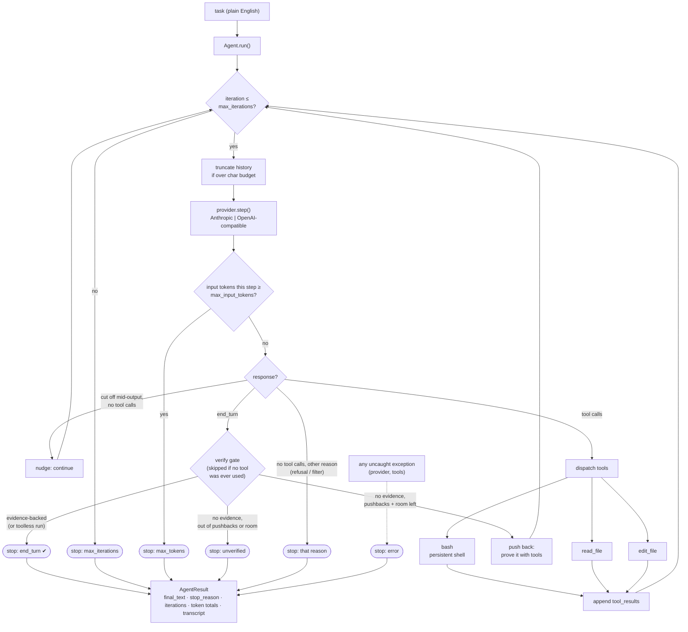

# mini-gt-swe — GroundTruth × mini-swe-agent

> **mini-gt-swe** modifies mini-swe-agent to use GroundTruth's deterministic
> context inside the agent loop. GroundTruth is the deterministic evidence engine
> inside that loop—not an after-the-fact trace annotator.**

This repository embeds **GroundTruth (GT)** — a deterministic, LLM-free codebase-evidence
engine — inside the modified mini-swe-agent loop. GT pre-computes a complete call graph of the
task repository (tree-sitter AST parsing via the Go `gt-index` binary) and appends verified
structural facts (definitions, caller contracts, signature deltas, covering tests, recovery
guidance) directly into the tool observations the model already reads — at most one evidence
dose per observation, append-only, sealed with a hash chain, and silent when it has nothing
verified to say.

The integration lives in `gt_engine/` (bridge, indexer, evidence-aware context management,
advisory verify gate) plus the lifecycle boundaries in `nano/agent.py`. A GT-enabled request
therefore follows a deterministic coding SDLC:

1. **Ideate/plan:** task-start obligations and ranked localization are inserted before the
   first model decision.
2. **Code:** pre-edit, edit, and post-edit observations are normalized through the GT gateway;
   applicable structural facts compete under the one-dose law.
3. **Verify/test:** executed syntax, covering-test, and observed-RED evidence update the
   completion decision; unavailable evidence is named and fails open.
4. **Penultimate submit check:** every GT-enabled completion is probed before acceptance.
   Positive failing evidence can refuse once; the second attempt cannot deadlock.
5. **Proof:** `gt_ledger.jsonl` proves sealed delivery bytes, while the hash-chained
   `gt_attribution.jsonl` records all 17 mechanisms as witnessed, dark, suppressed, faulted,
   or ineligible. Provider-request block lists—not trajectories—prove exposure to the next
   model response, whose resulting tool-call IDs/names are linked to those delivery IDs.
   Raw model text and tool arguments are never persisted. Exposure is not mislabeled as
   semantic consumption or causal benefit; a controlled GT-off baseline supplies the
   behavior/reward delta.

**With GT disabled
(no `--gt-root`), this harness preserves the stock mini-swe-agent path** — that property is
enforced by tests, and it is what makes clean GT-on vs. GT-off benchmark comparisons possible.

The base agent loop comes from mini-swe-agent. mini-gt-swe modifies it to inject
GroundTruth deterministic context while preserving a GT-off comparison path.

---

# mini-gt-swe


> Smallest readable coding-agent loop that scores on benchmarks.

mini-gt-swe is a modified mini-swe-agent **coding agent** — the code that wraps an
LLM and turns it into something that completes real work in a repository (a loop,
a small tool set, context management, and a system prompt). It is built to score
on agentic coding benchmarks (Terminal-Bench and SWE-bench Verified) while staying
tiny enough to read end-to-end in one sitting: **~970 non-blank lines** across five
files in `nano/`.

The design philosophy is the Karpathy "nano" aesthetic (nanoGPT, nanochat) applied
to agent harnesses: small, legible, no premature abstraction. The differentiator is
**score-per-line-of-code** — most popular harnesses compete on features and never
publish benchmark numbers; mini-gt-swe aims to be a tiny harness with reproducible,
published scores.

> ### ⚠️ Security: this runs model-generated commands with your full privileges
>
> The `bash` tool executes whatever the model emits — in your shell, as your user,
> with your environment, your filesystem, and your network. There is **no sandbox,
> no allow-list, and no workspace jail.** A prompt-injected or mistaken command can
> read your credentials, delete files, or make network calls.
>
> **Run it inside a disposable container** (the benchmark adapter already does this —
> every task runs in its own Docker container). Do **not** point it at a checkout on
> a workstation that holds secrets or anything you can't afford to lose.

## What this is

An agent harness for coding tasks. You give it a plain-English task inside a working
repository; it reads code, runs commands, edits files, runs tests, and reports back.

## What this is NOT

- **Not a general agent framework** — no plugin system, no extensibility for arbitrary
  domains.
- **Not a product with a UI** — no dashboard, no auth, no SaaS. The only surface is a CLI.
- **Not a chat assistant** — it is task-completion-focused, not conversational.

## Features

- **Reactive native-tool-use loop.** Uses the model provider's native tool-calling API
  directly (no ReAct text prompting). The model self-corrects step by step until it
  ends its turn or hits a budget limit.
- **Three tools, that's it.** `bash` (persistent shell), `read_file` (line-sliced
  reads), `edit_file` (unique-match string replace / file create). `bash` subsumes
  `ls`, `grep`, build, test, and install.
- **Provider-agnostic.** Ships with an Anthropic provider and an OpenAI provider behind
  one `Provider` protocol. The OpenAI provider also targets any OpenAI-compatible server
  (vLLM, Ollama, llama.cpp, Together) via `--base-url`.
- **Prompt caching.** The Anthropic provider marks the system prompt and the most recent
  user turn with `cache_control: ephemeral` — a meaningful cost win on long benchmark runs.
- **Context management.** Hard caps on iterations and input tokens, plus automatic
  truncation of the oldest `tool_result` blocks when the message history exceeds a
  character budget (keeps the message + tool-call id, drops the bulky content).
- **Persistent shell.** A single long-lived shell process preserves cwd, env, and shell
  state across `bash` calls; commands run with a per-call timeout that kills the whole
  process tree and respawns the shell on hang. A nonzero exit status is surfaced to the
  model as an error (a failing test can't be mistaken for a passing one). Uses `bash`
  everywhere it exists — including Windows via Git Bash; `cmd.exe` is a last resort only.
- **Benchmark eval harness.** A Terminal-Bench 2.0 adapter (`eval/tb_agent.py`) installs
  the exact local harness into each task container — no benchmark-specific forks — plus a
  structured run/transcript logger (`eval/log.py`).
- **Rich CLI output.** Streamed assistant turns and tool results render as panels.

## Benchmarks

Terminal-Bench 2.0, full 89-task suite, self-run through Harbor (each task in its own
Docker container, the exact shipping harness installed per container):

| Harness | Model | Tasks | Score |
|---------|-------|-------|-------|
| mini-gt-swe | DeepSeek V4 Flash | 89 (full) | **59.6% (53/89)** |

Self-run through Harbor, every task in its own Docker container, the exact shipping
harness installed per container. Errored trials (agent wall-clock timeouts on the
heaviest tasks plus one container OOM-kill) are counted as failures — the conservative
scoring. Measured on commit `0903552`; 16 h 25 m total runtime. Full task-by-task
breakdown and reproduce steps: [`docs/benchmarks/2026-07-18-tb2-89.md`](docs/benchmarks/2026-07-18-tb2-89.md).

An earlier build scored **53.9% (48/89)**. That run predates the correctness hardening
below — the same harness, same model, same suite went from 53.9% to 59.6% while ~20
correctness/safety bugs were fixed and the test suite grew from 52 to 87. The point
isn't the 5.7-point gain; it's that the gain came from making the harness *correct*
(a failing command now actually reads as a failure), not from benchmark-chasing.

### How it got here (honest version)

The first hardened build was sent to an independent frontier model for adversarial
review and scored **4/10** — one finding was a real correctness bug (a shell command
that failed was still reported to the model as success). Every finding was triaged and
fixed test-first. A second independent review scored **6/10** and caught defects the
first pass introduced; those were fixed too. A third pass (a multi-agent cloud review)
found only two nits. The test suite grew from 52 to 87 tests across the process. The
point of publishing this isn't that the harness is flawless — it's that the path from
4/10 to here is visible, tested, and in the commit history.

## Architecture


The harness is a small file tree under `nano/`, orchestrated by a single loop.



The load-bearing detail is the **verify gate**: when the model has used tools, a
"done" is only accepted with a successful tool call behind it since the last
challenge — otherwise it's pushed back to prove the work with real commands, and
if it can't before pushbacks or iterations run out, the result is returned as
`unverified` rather than reported as success. A run that never touched a tool
(a pure question) finishes normally; nothing to verify.

Key design choices:

- **Canonical internal message shape.** The agent keeps one provider-neutral message
  format (assistant messages carry `text` + structured `tool_calls`; user turns carry
  `tool_result` blocks). Each provider re-serializes from this shape into its own wire
  format — the Anthropic provider builds content blocks; the OpenAI provider splits
  `tool_result` blocks into `role="tool"` messages.
- **Provider is a `Protocol`.** Any object with a `model` attribute and a `step()` method
  is a valid provider, which keeps providers injectable for tests.
- **Token cap takes priority over natural completion** — if a step breaches the input-token
  budget, the run stops with `max_tokens` even if the model said `end_turn`.
- **Tools fail loudly.** `edit_file` refuses non-unique matches and refuses to overwrite an
  existing file on create; tool errors are returned to the model as `ERROR:` text so it can
  diagnose and adjust rather than crash the loop.
- **"Done" is earned, not claimed.** A completion is only accepted when backed by a
  successful tool call since the last challenge; an evidence-less "done" is pushed back, and
  if the loop runs out of room the result is kept but labelled `unverified` rather than
  reported as success.

### Module layout

| Path | Responsibility |
|------|----------------|
| `nano/agent.py` | The `Agent` loop, `AgentResult`, history truncation, tool dispatch wiring. |
| `nano/providers.py` | `Provider` protocol, `AnthropicProvider`, `OpenAIProvider`, message normalization, `StepResult`/`Usage`/`ToolCall` models. |
| `nano/tools.py` | `BashTool` (persistent shell), `read_file`, `edit_file`, the `TOOLS` schema list, and `dispatch`. |
| `nano/prompts.py` | The system prompt and an approximate token counter. |
| `nano/cli.py` | `nano run` CLI: argument parsing, provider selection, Rich event rendering. |
| `eval/tb_agent.py` | Terminal-Bench 2.0 (Harbor) installed-agent adapter. |
| `eval/log.py` | `RunLog` / `TaskRecord` — structured run manifests and per-task transcript JSONL. |

## Setup / Install

Requires **Python ≥ 3.12**.

```bash
# clone, then from the project root:
pip install -e .            # installs the `nano` CLI entry point

# optional extras
pip install -e ".[dev]"     # pytest, pytest-asyncio, ruff
pip install -e ".[eval]"    # harbor, swebench (for benchmark runs)
```

The project uses a `hatchling` build backend and exposes a console script `nano`
(see `pyproject.toml`). `uv` works as a drop-in (`uv tool install .`), and the
Terminal-Bench adapter installs the harness with `uv` inside task containers.

## Usage

Run the agent on a task in the current repository:

```bash
# default model
nano run "Add a --verbose flag to the CLI and a test for it"

# pick a model
nano run "Fix the failing test in tests/test_log.py" --model deepseek-v4-flash --base-url https://api.deepseek.com/v1
nano run "..." --model gpt-4.1

# point at any OpenAI-compatible server (vLLM, Ollama, llama.cpp, Together, ...)
nano run "..." --base-url http://localhost:8000/v1 --model my-local-model

# cap the loop length
nano run "..." --max-iterations 50
```

The CLI streams each assistant turn and tool result as a panel, then prints a final
summary line: `stop reason`, iteration count, and input/output/cache-read token totals.
Exit code is `0` when the run ended naturally (`end_turn`), `1` otherwise
(`max_iterations` / `max_tokens` / `error`).

### Benchmark evaluation (Terminal-Bench 2.0)

The adapter uploads the local checkout into each task container, installs it with `uv`,
and runs `nano run "<instruction>"` inside — so the benchmarked harness is byte-for-byte
the harness that ships locally. Requires Docker running on the host.

```bash
pip install harbor
export OPENAI_API_KEY=...
export OPENAI_BASE_URL=https://api.deepseek.com/v1
harbor run -d terminal-bench@2.0 \
    -a eval.tb_agent:NanoAgent \
    -m deepseek-v4-flash \
    -l 10 -n 2 -o results/terminal-bench \
    --job-name my-run --agent-timeout-multiplier 2.0 -y
# smoke-test a single task first with: -l 1
```

On Windows, `scripts/tb2_slice.ps1` wraps this: it loads the gateway token from
`.env`, forces UTF-8 (Harbor writes result JSON with the platform default encoding
and crashes on unicode otherwise), stamps a unique job name, and supports
`-Resume`/`-RetryErrors`. Results land under
`results/terminal-bench/<job-name>/result.json`.

## Configuration / Environment

Configuration is via CLI flags and environment variables (no config file).

| Env var | Used by | Purpose |
|---------|---------|---------|
| `ANTHROPIC_API_KEY` | Anthropic provider | API key for `claude*` models. |
| `OPENAI_API_KEY` | OpenAI provider | API key for OpenAI models. For local OpenAI-compatible servers a placeholder (`sk-local`) is supplied automatically when unset. |
| `OPENAI_BASE_URL` | eval adapter | Forwarded into task containers alongside the API keys. |

CLI flags for `nano run`:

| Flag | Default | Meaning |
|------|---------|---------|
| `task` (positional) | — | Plain-English task description. |
| `--model` | `claude-opus-4-8` | Model name. Names starting with `claude`/`anthropic` route to the Anthropic provider; otherwise OpenAI. |
| `--base-url` | none | OpenAI-compatible base URL (forces the OpenAI provider). |
| `--max-iterations` | `30` | Hard cap on loop iterations. |

Tunable `Agent` defaults (in code): `max_iterations=30`, `max_input_tokens=200_000`,
`truncation_char_budget=120_000` (≈30k tokens of tool-result content). Tool output is
truncated at 16,000 chars per call.

## Project structure

```
mini-gt-swe/
├── nano/                 # the harness (the part that ships)
│   ├── agent.py          # loop + AgentResult + truncation
│   ├── providers.py      # Anthropic / OpenAI providers behind a Protocol
│   ├── tools.py          # bash / read_file / edit_file + dispatch
│   ├── prompts.py        # system prompt + token approximation
│   ├── cli.py            # `nano run`
│   └── __init__.py       # __version__
├── eval/                 # benchmark glue (not part of the agent itself)
│   ├── tb_agent.py       # Terminal-Bench 2.0 Harbor adapter
│   └── log.py            # run manifests + transcript logging
├── tests/                # pytest suite (agent, cli, providers, tools, prompts, log)
├── docs/                 # design spec, architecture, external review artifacts
├── scripts/tb2_slice.ps1 # Windows Terminal-Bench runner (gateway, UTF-8, resume)
├── pyproject.toml        # deps, scripts, ruff/pytest config (hatchling build)
└── CLAUDE.md             # project context / working norms
```

## Testing

```bash
pytest          # configured via [tool.pytest.ini_options]; testpaths = ["tests"]
ruff check .    # lint (line length 100, py312 target)
```

## Notes

- **Status.** The project began in a brainstorm phase (`CLAUDE.md`/`memory.md` reflect that
  early state), but the harness, providers, tools, CLI, eval adapter, and a full test suite
  are now implemented. The benchmark target is **Terminal-Bench primary, SWE-bench Verified
  secondary**, both aiming for a published, reproducible >30% score from the same harness.
- **Minimalism is a constraint, not a vibe.** Per the working norms, any file passing ~500
  lines "without a damn good reason" is treated as a design smell.
- **Cross-platform shell.** `BashTool` prefers `bash` everywhere — on Windows it resolves
  Git Bash and deliberately skips the `System32\bash.exe` WSL launcher (different filesystem
  namespace); `cmd.exe` is a last resort, with its prompt artifacts stripped from output.
- Pass `--model` to target whatever model you have access to; the default is
  `claude-opus-4-8`.
- `docs/superpowers/` holds the formal design spec and implementation plan; `docs/reviews/`
  keeps the external review artifacts referenced above.

## License

MIT — see [LICENSE](LICENSE).
# GroundTruth benchmark product — current evidence boundary

This README describes the current, provisional provider-free GroundTruth (GT)
benchmark-product boundary; it does not claim that a shipped benchmark release
exists. Claims are subordinate to the exact source heads and receipts recorded
in HAR-56/HAR-57; issue status is not evidence. At this exact pinned assembly
(not merged to main), the source tree includes graph-native repository
intelligence (`gt_engine/repository_intelligence.py`), provenance-aware
resolution (`gt_engine/resolution_provenance.py`), and source-backed
capability-matrix machinery (`gt_engine/graph_context.py`). Deterministic
communities (HAR-7), hybrid retrieval (HAR-8), and lifecycle accounting remain
on unmerged predecessor units; they are named here only as in-assembly targets,
not as modules present in this tree. Construction remains incomplete: 15 of 21
GT-related units are unmerged; the verdict-coverage gate (HAR-30) passed at
`d482ca51` (REV-138) but has not merged onto main. Every capability claim is
provisional until its source revision, fixture, manifest, and terminal verdict
are present and current; missing or stale inputs remain fail-closed.

The benchmark release gate is currently **not authorized**. Final repository
heads, terminal verdict coverage, and the assembled provider-free receipt must
settle before a benchmark command can be proposed. No provider or paid benchmark
run is implied by this repository. The eventual stop token is
`BENCHMARK_READY_AWAITING_USER_RUN_APPROVAL`; explicit user approval of the
frozen tasks, model/provider, limits, environment, account, duration, outputs,
cost estimate, and hard ceiling is required before any run.

## Evidence and runtime flow

At task start, the runtime binds the repository and workspace revisions, leases
the last complete graph, and exposes only graph-native facts with their source
and evidence identities. Retrieval separates edit owners, inspection
dependencies, public surface, affected tests, validation commands, and
unresolved identities. Ambiguous or stale facts remain candidates or abstain;
they never become verified singletons. Persisted receipts are content-addressed
and replay verification recomputes their semantic digests and cited source
bytes. Provider calls are recorded explicitly and must be zero for the
provider-free baseline.

The root README is descriptive only. Executable truth lives in the production
modules and their receipts; the HAR-29 documentation boundary is satisfied only
when every statement here resolves to those pinned bytes.

## Public re-audit

After normal project dependencies are installed, run the provider-free public
audit from a clean checkout:

`python scripts/gt_reaudit.py --groundtruth-root <clean-root> --output <receipt>`

For a checkout rooted at the harness repository, the equivalent explicit
alias is:

`python scripts/gt_reaudit.py --harness-root <clean-root> --output <receipt>`

On a valid clean checkout both forms emit a PASS receipt with
`failure_code: null`.

The command inspects immutable Git identities, source manifests, shipped test
and producer surfaces, and emits a deterministic `gt.public_reaudit.v1` receipt.
It never changes a default branch and returns a nonzero status with a stable
failure code when an identity or receipt-chain check cannot be completed.

## Deep pipeline architecture (as built)

This section is the operational description of the tree at the commit that contains it. It is
limited to checked-in code, receipts, and workflows; it does not describe a planned service or a
benchmark result.

### 1. Request intake and persistent state

`nano/cli.py` parses a task and constructs the provider and `nano/agent.py` `Agent`. The agent
owns the iteration loop, history truncation, tool dispatch, token/iteration limits, and the
evidence-backed completion gate. `gt_engine/task_contract.py` turns task text into the task and
obligation contract used by planning and verification. `gt_engine/persistent_execution_state.py`
persists decision and iteration lineage. Its records are `gt.execution_state.v1`,
`gt.execution_state.witnessed_process.v1`, `gt.select_catalog.v1`,
`gt.select_catalog_lifecycle.v1`, `gt.witnessed_process.v1`, and `gt.planning_process.v1`.

`gt_engine/gt_session.py` is the control plane for off, shadow, advisory, assistive, and enforced
modes. `gt_engine/miniswe_controller.py`, `gt_engine/miniswe_runtime.py`, and
`gt_engine/miniswe_integration.py` connect that session to the normal Mini-SWE loop. A disabled
session leaves the stock path intact; enabling GT does not create a second agent loop.

### 2. Index build, reuse, and publication

`gt_engine/indexer.py` computes an `IndexReuseKey` from the sorted, length-delimited source
manifest (path plus Git-blob byte hash), the verified producer binary SHA-256, and the graph
schema version. The key is serialized as `index_reuse_key` and bound by
`index_reuse_key_sha256`; it is not inferred from a filename. A matching key is accepted only
after source-manifest validation, graph digest validation, producer-artifact validation, and
SQLite `PRAGMA quick_check`. A miss or invalid hit runs the producer into a temporary database,
checks it, and uses `os.replace` to publish atomically. An interrupted build therefore leaves
the previous complete graph available.

The graph receipt is `gt.graph_certification.v1`. The accepted external producer is described by
`gt.producer_artifact.v2` in `gt_finalstand/receipts/producer_artifact.json`; its source commit,
source tree, binary digest, build ID, toolchain, graph schema (`v15.2-trust-tier`), and capability
set are verified before discovery. `gt_engine/har80_import_parity.py` verifies the route-B
Python import surface using `gt.har80.import_parity.v1`, while
`gt_finalstand/receipts/har80_route_b.json` (`gt.har80.route_b.v1`) states that the wheel
certifies the Python runtime and the pinned source certifies the binary and framework overlays.
The producer source and harness are separate repositories; a changed producer commit or tree
requires a new artifact and a new harness pin.

### 3. Evidence production and graph projections

The verified graph is read through `gt_engine/bridge.py` and `gt_engine/graph_context.py`.
`gt_engine/repository_intelligence.py` supplies repository facts and community projections;
`gt_engine/hybrid_repository.py` supplies repository-level composition. The capability matrix is
`gt.capability_matrix.v2`, and the shipped feature matrix is `gt.feature_matrix.v1` (its rendered
table is `gt.feature_matrix.md.v1`). Community certificates use `gt.community_certificate.v2`
and are independently checked before they can influence retrieval.

`gt_engine/resolution_provenance.py` represents a callsite, dispatch state, retained candidates,
and flow witnesses. `gt_engine/why_this_edge.py` is the certified explanation path for
`HAS_CALLSITE`, `CANDIDATE_TARGET`, and `SELECTED_TARGET`; its records use
`gt.why_this_edge.v1`, `gt.resolution_substrate.v1`, `gt.why_this_edge_store.v1`, and the
receipt `gt.why_this_edge_receipt.v1`. Candidate-to-witness conservation is checked before an
explanation is returned. Unsupported edge kinds, ambiguous dispatch, stale graphs, incomplete
builds, or missing witnesses produce typed abstention rather than a guessed target.

`gt_engine/trust_calibration_report.py` emits `gt.trust_calibration_report.v2`. Calibration is
partitioned into the closed capability classes `resolution`, `retrieval`, and `community`; an
observation without a legitimate probability has null probabilistic metrics and cannot upgrade
authority. The manifest generator uses `gt.trust_calibration_manifest.v1`. Calibration is a
measurement report, never an authority override.

`gt_engine/hybrid_retrieval.py` performs vector-accelerated candidate discovery followed by exact
rescoring. Policy `gt.hybrid.intent-exact-rescore.v1` selects weights for `INSPECT`, `EDIT`, or
`VALIDATE`; the vector result is unioned with every positive lexical and graph candidate before
rows are fetched and scored. A named full-scan fallback is used only when vec0 is unavailable or
fails. Stored metadata identity, finite/non-negative channel scores, candidate-set digest, and
deterministic ID tie-breaking are checked in the result. Intent changes ranking only; it does not
change candidate membership or evidence authority.

### 4. Observation, packet assembly, and eligibility

`gt_engine/runtime_observation.py` captures action-boundary snapshots, revisions, transactions,
postimages, syntax artifacts, and execution outcomes. Its records use
`gt.runtime_observation.v1`, `gt.transaction_artifacts.v1`, and
`gt.observation_equivalence.v1`. `gt_engine/miniswe_typed_actions.py` validates the public
typed-action schema `gt.action_request.v1`, produces `gt.evidence_artifact.v1` and
`gt.interception_decision.v1`, and renders the single model-visible
`gt.compiled_observation.v1` path. Legacy or manually fabricated removed actions are rejected by
the generated certification surface `gt.typed_capability_certification.v1`.

`gt_engine/context_packet.py` assembles the context dose as `gt.context_packet.v1`. The packet
contains ordered evidence, source identities, graph/revision identity, and the delivery hash
chain; it is the only content handed to the model after normalization. `gt_engine/evidence_router.py`
implements the HAR-64 boundary admission decision as `gt.eligibility_receipt.v1`. It measures the
complete logical request immediately before transport, records every proposed claim as admitted
or refused with a closed reason, binds baseline and final request digests and sizes, and includes
prior-event and receipt digests. Refused bytes cannot appear in the final payload. Zero-evidence
decisions and provider exceptions still get a receipt; if sealing fails, only the native baseline
request is allowed and the run is degraded/unverified.

The HAR-74 `serve_context_packet` wiring calls the same router and verifies/seals the packet before
returning it. No sidecar ledger is authoritative. `gt_engine/miniswe_receipt.py` records the
provider-bound receipt `gt_receipt.v1`; `gt_engine/event_journal.py` records hash-chain rows
`gt.event.v1`. `gt_engine/attribution.py` records capability eligibility and exposure without
claiming that exposure caused a model action.

### 5. Model boundary, execution, and verification

`nano/providers.py` normalizes Anthropic and OpenAI-compatible responses into the provider-neutral
message shape. `nano/tools.py` exposes the three native tools (`bash`, `read_file`, and
`edit_file`); a tool error is returned as an explicit `ERROR:` observation. The runtime retains
tool-call IDs and names but does not persist raw model text or tool arguments.

`gt_engine/miniswe_runtime.py` and `gt_engine/miniswe_integration.py` execute actions through the
gateway. `gt_engine/verification_contract.py`, `gt_engine/verify.py`, `gt_engine/decision_point_eval.py`,
and `gt_engine/miniswe_audit.py` check syntax, covering tests, observed RED evidence, and
completion criteria. The submit gate is wired in `gt_engine/miniswe_integration.py`: positive failing
evidence can refuse one submit, while the second attempt cannot deadlock. A failing command
remains a failing observation; there is no success conversion on exception.

Resolution remains fail-closed: `AMBIGUOUS` dispatch, unresolved candidates, incomplete builds,
or stale graph identity are surfaced as typed abstention. Retrieval and community membership can
shape context, but neither can promote an unverified fact to authority.

### 6. Receipts, replay, and integrity

`gt_engine/replay.py` and `gt_engine/replay_bundle.py` consume sealed event and delivery records;
the replay bundle uses `gt.bundle-replay.v1`, and the reproducibility manifest is `gt.repro.v1`.
The checked-in `gt_finalstand/receipts/` directory contains the terminal classes used by the
provider-free audit: `gt.baseline_receipt.v2`, `gt.har9.closeout_receipt.v1`,
`gt.no_smoke.gh_authed.v1`, `gt.finalstand.offline_suite.v2`,
`gt.provider_free_workflow_receipt.v1`, `gt.public_reaudit.v1`,
`gt.trust_calibration_report.v2`, `gt.why_this_edge_receipt.v1`,
`gt.eligibility_receipt.v1`, `gt.community_certificate.v2`,
`gt.har70.framework_resolution.v1`, and `gt.har72.benchmark_design.v1`.
The exact schema names are carried in each JSON receipt; the receipt digest is calculated over
the canonical unsigned body and the shipped Git-blob bytes are the binding source.

`scripts/gt_reaudit.py` is the public replay entry point. It verifies the manifest, source and
fixture digests, producer identity, Git-blob receipt digests, canonical RED producers, mutation
checks, and output digest, then emits `gt.public_reaudit.v1` with a stable failure code. The
provider-free workflows under `.github/workflows/` run these checks without provider calls.

### 7. Review transport and merge

`scripts/ci_emit_review_packet.py` creates `gt.review_packet.v1` outcome packets. The
digest-validating inbox writer on `refs/heads/gt-review-inbox` writes one packet and updates
`inbox/INDEX.json` atomically; `scripts/ci_commit_review_packets.py` validates
CI packets before they enter that ref. Packet identities bind repository, branch, base, head,
parent, changed paths, commands, exit statuses, and observed failure or pass detail. Historical
packets remain immutable; corrections are new packets with an explicit `supersedes` link.

The review loop reads the inbox and posts exact-head decisions on HAR-57. A terminal pass names
one immutable candidate SHA. A fast-forward grant names that same candidate and the current
default tip. Before landing, the builder fetches both refs, verifies ancestry and that neither ref
moved, then uses `git merge --ff-only` and verifies the remote default resolves to the candidate.
The merge outcome is itself a `gt.review_packet.v1` packet. A RED CI packet or stale review blocks
the merge; no merge commit, force push, or mutable historical packet is accepted.

### 8. Cross-repository pins and currency

`gt-harness` owns the Python control plane, schemas, receipts, workflows, and Mini-SWE wiring.
`groundtruth` owns the Go `gt-index` producer, graph construction, and framework overlays. The
harness records the producer source commit/tree, binary digest, toolchain, platform, graph schema,
and capabilities in `gt.producer_artifact.v2`; `.github/workflows/ci.yml` checks out that exact
source commit. The route-B receipt records the deliberate split between the certified Python wheel
and the certified source-built binary/overlay surface. Any producer source, tree, binary, schema,
or capability change invalidates the pin and requires a new producer receipt, a new harness
commit, and fresh exact-SHA review.

The README, code, workflows, fixtures, and receipts are one versioned contract. Any pipeline
change must update this README in the same commit so the narrative remains current with the
implementation. No section above claims provider execution, benchmark execution, or a capability
that is not represented by a checked-in module, workflow, fixture, or receipt at this commit.

### CI parallelism and failure packets (HAR-79)

The `pytest` job in `.github/workflows/ci.yml` runs the provider-free suite with
`pytest -n auto -q -ra` on each Python version. `pytest-xdist==3.8.0` is part of the `dev`
extra, so the command is reproducible from the normal project installation. The matrix jobs
remain separate and `continue-on-error` is still paired with the recorded pytest exit status;
the final `Fail on RED suite` step therefore keeps the dual outcome/exit gate.

Before enabling xdist, the test tree was audited for shared-state hazards. Tests use pytest's
per-test `tmp_path` and `monkeypatch` fixtures for files, environment, and working directories;
the index and SQLite cases create paths below those temporary directories; no test reserves a
fixed TCP port or a shared SQLite filename. The workflow's two Python jobs also run on separate
fresh runners. No serial subset is required by this audit.

Each CI packet still has schema `gt.review_packet.v1`, and now records measured
`detail.durations.setup_seconds` and `detail.durations.test_seconds`, plus the `parallel` flag
and worker setting. The pytest transcript is run with `-ra`; on RED,
`scripts/ci_emit_review_packet.py` records node IDs and first errors as before, and additionally
stores a capped traceback excerpt per failing node and the capped pytest short-summary block.
The packet alone consequently identifies the failing test, error text, and relevant location
without requiring an Actions-log lookup. Provider calls and benchmark runs remain zero.
