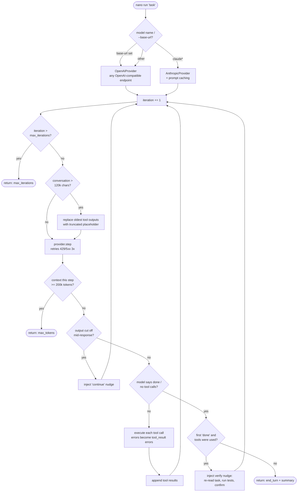
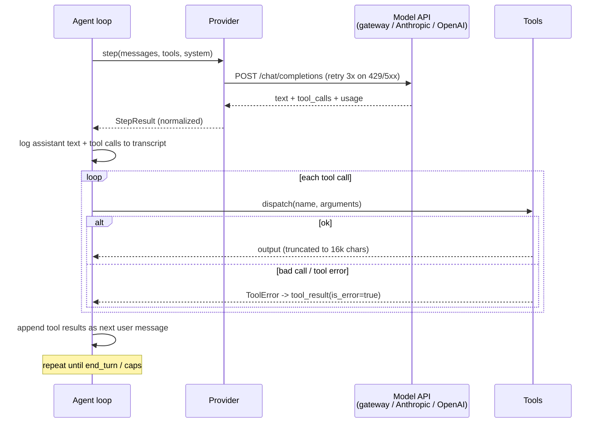
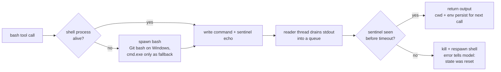

# nano-harness — How It Works

One loop, three tools, two providers. ~850 physical lines total. This doc traces
exactly what happens when you run `nano run "fix the bug"`, so you can see where
efficiency lives and where it leaks.
v
## The pipeline, step by step

> The Terminal-Bench GT arm is `eval.gt_central_agent:MiniSweCentralAgent`.
> Its preflight/postflight lifecycle and provider accounting are documented in
> `docs/architecture.md` and `AGENTS.md`; the nano loop below is a separate
> harness and must not be used to infer central-runtime timing.

1. **CLI** (`cli.py`) — parses args, forces UTF-8 stdout, routes the model name
   to a provider: `--base-url` set → `OpenAIProvider` against any
   OpenAI-compatible endpoint (ASU gateway, vLLM, ollama); name starts with
   `claude` → `AnthropicProvider`; anything else → `OpenAIProvider`.
2. **Agent loop** (`agent.py`) — the core. Repeats: send conversation → get
   text + tool calls → execute tools → append results → repeat. Stops on
   `end_turn`, iteration cap (30), or context cap (200k tokens/step).
3. **Tools** (`tools.py`) — `bash` (persistent shell: bash everywhere, incl.
   Windows via Git bash; cmd.exe fallback only), `read_file` (line-numbered),
   `edit_file` (exact unique string replacement). Malformed calls come back as
   errors the model can fix, never crashes.
4. **Guards** — four things keep a run from dying or lying:
   - *Truncation*: conversation over ~120k chars → oldest tool outputs replaced
     with `[truncated]` placeholders (structure kept).
   - *Retry*: 429/5xx/connection errors retried 3× with backoff.
   - *Continuation*: output cut off mid-response → "continue" nudge, not false
     success.
   - *Verify pass*: the first "done" gets challenged once — re-read the task,
     run the tests, then finish.
5. **Result** — `AgentResult` with stop reason, iteration count, token totals,
   and a full transcript (every message, tool call, and tool result).

## The main loop



## One iteration, on the wire



## The persistent shell



Key property: `cd` and `export` survive between calls — the model works in a
real session, not one-shot commands. On timeout the whole shell dies and the
model is told its state is gone.

**Known limitation:** `read_file`/`edit_file` resolve relative paths against
the *process* cwd, not the shell's live cwd. A model that `cd`s in bash then
edits a relative path hits the wrong file. Documented, deferred (fix needs
MSYS path translation on Windows).

## Where the efficiency lives (and leaks)

| Mechanism | Status | Effect |
|---|---|---|
| Prompt caching (`cache_control`) | Anthropic direct only — **inactive through the gateway** (all head-to-head runs show `cache_read=0`) | biggest cost leak on long tasks |
| Iteration cap (30) | active | load-bearing for weak models (haiku hit it on all 3 tasks) |
| Tool output truncation (16k chars) | active | keeps one noisy command from flooding context |
| Conversation truncation (120k chars) | active | keeps long runs inside the window |
| Verify pass (1 extra step) | active | buys correctness for ~1 iteration of cost |
| Loop/thrash detection | **none** | haiku burned 30 iterations on 1-line fixes; nothing stops identical repeated calls |

## Final regression-repair contract (2026-08-09)

GT source identity is semantic. SourceRevisionReceipt hashes canonical source path plus full-content SHA-256 only; raw workspace metadata remains a separate audit revision. Missing source digests invalidate graph refresh and completion certification without blocking Mini-SWE. Internal revision hashes are never model-visible.

Repository facts have persistent provenance (TASK_START, MODEL_AUTHORED, OBSERVED_EXTERNAL, or UNKNOWN) and exactly one eligible provider call. Task-start facts cannot spill, and new claims on model-authored paths remain controller-only. Genuine new cross-file consequences may remain eligible. newfile_precedent can use only a non-empty compatible task-start source and receipts precedent_origin=task_start_repository.

ProviderEvidenceLedger is the authoritative provider-context accounting surface. It joins graph_frontier, feature_fact, state_frame, progress_frame, and preflight_return events to evidence action, eligible/prepared/dispatched calls, exact provider message indices, request hash, characters, disposition, reasons, and revision. A represented fact with zero newly inserted characters is correct GT operation; never force provider text merely to avoid a zero-visible count.

Provider request lifecycle is explicit: provider_requests_prepared, model_query_invocations, provider_responses_received, and provider_requests_not_sent. api_calls equals actual model_query_invocations. An unsent prepared request confirms no delivery and contributes no visible context.

Deterministic compaction restores only a current fact whose last concrete provider representation it removed. It does not inject generic controller state, repeat adjacent frames, delete unique assistant reasoning, or truncate a fact. StallAggregateFact is a separately gated controller fact, not an eighteenth feature: deterministic, declarative, <=320 characters, at most twice per task, first-eligible, source-bound, and non-predictive.

Replay v2 is exact and content-addressed under gt_replay/ (manifest.json, calls.jsonl, blobs/<sha256>.json.gz). The verifier fails closed on corruption. Workspace source capture caches its working backend; a missing task-image python3 is not retried on every edit. Local graph resolution prefers the checked-out pinned gt-index binary over obsolete machine-global builds.

Efficiency gates aggregate provider/model resources only across common uncensored solves. Tokens, actual model calls, model-selected actions, assistant responses, cost, and wall time are primary. Effective actions and host/controller/sensor executions are reported separately. Cheap failed tasks cannot improve the aggregate.

## Typed redirection, result semantics, and edge-only progress (2026-08-09)

`ActionProposalAdapter` first produces semantic argv and a separate list of
redirections. Attached file descriptors are retained as redirection metadata,
not operands. Descriptor duplication has no filesystem effect, file output is
a typed write, and file input is a typed read. The immutable validation
classification and preflight proposal therefore agree even for a redirected
declared validator.

`ProgressObservation` contains two content-addressed identities. Its attempt
identity excludes the result; its observation identity adds the executable-
aware result kind, output digest, and diagnostic fingerprint. Search no-match,
file difference, validation pass/fail, host timeout, shell timeout, execution
error, and ordinary success are distinct. Read/search anchors are committed
only for valid observations. Authored patches are activity, diagnostics and
localization are observations, and only attributed validation passes or
confirmed task outputs are task-progress gains.

`ProgressLedger` emits transitions, not repeated state snapshots. Once
`STALLED`, `CONTRADICTED`, or `BUDGET_RISK` is visible, another same-state
update is receipt-only. This bounds the progress delivery surface without
hiding the underlying action/observation history.

Context-frontier relevance is also decision-conditioned. File paths authorize
file anchors only. Structural facts require an exact current symbol or
relationship target and a valid structural symbol. Every rejection remains in
frontier accounting. Deep metrics expose response batching, actual actions per
model invocation, typed progress counts, validator redirection preservation,
adaptive/default validation timeouts, and action timeouts. Strict efficiency
promotion includes assistant steps and effective actions.

Provider-free implementation evidence is recorded in details_done/GT_FINAL_REGRESSION_REPAIR_AND_89_GATE_20260809.md. The archived ten-task replay passed; this is not live outcome proof. The next permitted paid step is the exact ten-task certified_full/integrated GT-on smoke after the exact pushed commit prints SMOKE_APPROVED. Preflight remains SHADOW. The 89-task run remains blocked until that smoke has no uncensored outcome regression/censor, valid graph substrate, complete provider-evidence accounting, zero invalid/late/predictive/duplicate delivery, and an aggregate common-solved provider/model efficiency win.
# Hybrid repository evidence path (2026-08-10)

The final retrieval path is shared rather than benchmark-specific:

```text
task + current trajectory + source revision
    -> RetrievalState
    -> exact | lexical | BM25 | local Snowflake ONNX | GraphDB structure
    -> equal reciprocal-rank fusion (k=60, unique files)
    -> certification/support gate
    -> complete-evidence token packing (<=3 spans)
    -> ranked receipt + optional PreemptiveFrame
    -> exact next Mini-SWE provider request
```

`build_hybrid_repository()` adapts the certified GraphDB and exact checkout
into source-span documents plus directed structural links. Edges, assertions,
and verified closure can carry explicit delivery certification. Co-change
pair/set facts are deterministic ranking evidence only. Active and changed
files are excluded from final results because the model already has those
anchors; graph links retrieve callers, tests, and ripple files beyond them.

The local dense channel is
`Snowflake/snowflake-arctic-embed-m` at immutable revision
`7802add0519e4bf94c46ef23552176697c7a1ac7`; its ONNX bytes are bound to SHA-256
`564e6c65ee0c739a486702e9e3e9b33c3f697c19c34dbe886bce9eec497ce971`.
The GitHub prepare job downloads and verifies the asset once, then passes the
same artifact to all shards. No inference API is used. Query/document roles,
CLS pooling, truncation, normalization, cache hits/misses, and backend identity
are receipt-visible.

The additive provider transformation is gated by
`enable_preemptive_retrieval=false` by default. When active, it runs inside
`MiniSweCentralAgent` before `model.query()`, preserves legacy feature/frontier
payloads, and adds no model or tool turn. Exact request hashes prove exposure.
Invalid timing, revision, duplication, budget, timeout, or substrate state
abstains. This path is not enabled in paid coding workflows until ARB and an
authorized runtime smoke pass; therefore the architecture is implemented but
end-to-end benefit remains unproven.
