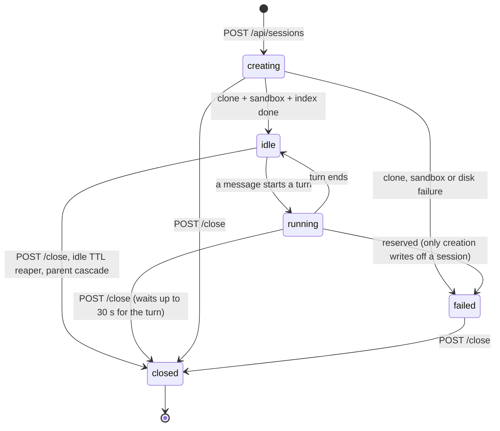
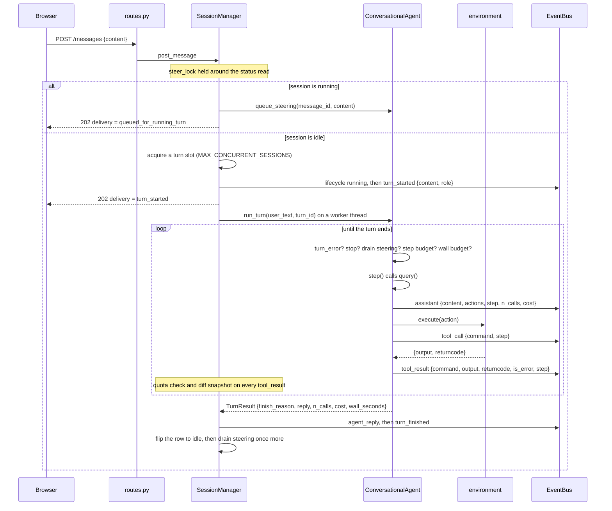

# Architecture, as built

Everything below is the code committed at `645fe276` on
`cloud/internal-harness`. Nothing is in progress.

- [1. Components and boundaries](#1-components-and-boundaries)
- [2. Session state machine](#2-session-state-machine)
- [3. The turn loop and its step boundaries](#3-the-turn-loop-and-its-step-boundaries)
- [4. Event bus and SSE](#4-event-bus-and-sse)
- [5. Diff snapshots](#5-diff-snapshots)
- [6. The file-relation graph](#6-the-file-relation-graph)
- [7. Worker agents](#7-worker-agents)
- [8. GroundTruth in the cloud](#8-groundtruth-in-the-cloud)
- [9. The browser](#9-the-browser)
- [10. Persistence](#10-persistence)
- [11. Concurrency, threads and locks](#11-concurrency-threads-and-locks)

---

## 1. Components and boundaries

```mermaid
flowchart TB
  browser["Browser — React + Vite SPA (cloud/ui/src)"]

  subgraph host["Deployment host (Codespace or VM)"]
    nginx["nginx :80 — cloud/ui/nginx.conf<br/>SPA + /api /auth /health, proxy_buffering off"]

    subgraph server["server container :8000 — cloud/Dockerfile"]
      app["FastAPI app — app.py, routes.py, auth.py"]
      mgr["SessionManager — runner.py"]
      agent["ConversationalAgent — conversational_agent.py<br/>(mini-SWE DefaultAgent subclass)"]
      bus["EventBus — events.py"]
      store["SessionStore — store.py"]
      graph["codegraph.py"]
      gtidx["gt-index (source-built) + groundtruth_mcp wheel"]
    end

    sqlite[("SQLite — db-data volume")]
    ws[("Workspaces — one clone per session")]

    subgraph net["gt-sandbox-net (--internal)"]
      sbx["gt-sandbox-SESSIONID<br/>uid 1000, cap-drop ALL, /workspace bind mount"]
      proxy["gt-egress-proxy :3128 — allow-list only"]
    end
  end

  model["Model provider — LiteLLM / OpenAI-compatible"]
  github["github.com, package registries"]

  browser -->|HTTPS| nginx
  nginx -->|REST + SSE| app
  app --> mgr
  app --> bus
  app --> store
  mgr --> agent
  mgr --> bus
  mgr --> store
  mgr --> graph
  mgr --> gtidx
  store --- sqlite
  mgr --- ws
  agent -->|docker exec| sbx
  agent -->|model calls| model
  sbx --- ws
  sbx -->|HTTP_PROXY| proxy
  proxy --> github
  gtidx --- ws
  graph --- ws
```

### The boundaries that matter

| Boundary | Rule |
|---|---|
| Browser to server | Same origin. nginx serves the SPA on port 80 and reverse-proxies `/api`, `/auth` and `/health` to `server:8000`. `CORS_ORIGINS` is empty by default and the app adds no CORS middleware at all when it is (`app.py:cors_origins`). |
| Server to sandbox | One `docker exec` per agent command. The command string stays a single argv element, run as `timeout --signal=KILL <n>s bash -c <command>` under uid 1000 (`sandbox.py:exec_argv`). |
| Sandbox to network | The sandbox network is created `--internal`: no route off the host, no external DNS. The only way out is `gt-egress-proxy`, reached through `HTTP_PROXY`/`HTTPS_PROXY`. |
| Server to model | Model calls happen **in the server process**, never in a sandbox. That is why the model API is not on the egress allow-list. |
| Server to workspace | The workspace is a plain directory on the host. The server clones, indexes, diffs and applies patches on it directly; the sandbox bind-mounts the *same* directory at `/workspace`. |
| Bind-mount path equality | Compose mounts `${WORKSPACES_HOST_DIR}` into the server at the **same absolute path** and sets `WORKSPACES_DIR` to it, because `docker run -v` is resolved by the daemon on the host. The path the server writes and the path the daemon binds are then the same string, so there is no translation layer to get wrong. |

### Environments

`SessionManager._build_agent` picks one of two environments and hands it to the
agent. Both return the same dict from `execute` (`output`, `returncode`,
`exception_info`, plus `extra` on failure) and both expose `interrupt()`.

| `SANDBOX_MODE` | Environment | Where commands run |
|---|---|---|
| `local` (default outside compose) | `CloudLocalEnvironment` (`environment.py`) | The server process's own machine account, under `bash -c`, with a credential-scrubbed environment. |
| `docker` (the compose default) | `DockerSandboxEnvironment` (`sandbox.py`) | `docker exec` into this session's container. |

Both are wrapped once more by `_EmittingEnvironment` inside
`ConversationalAgent`, which is the seam that emits `tool_call` / `tool_result`.
That wrapper exists because `gt_engine.miniswe_runtime.install_runtime_hooks`
*replaces* `agent.execute_actions` with a GT version that calls `env.execute`
itself and never delegates back. Emission anchored in `execute_actions` fired on
GT-off sessions and produced nothing at all on GT-on ones — measured at 0/0
persisted tool frames on a GT-advisory session before the fix (`fa6a4a23`,
[cloud-qa-round2-fixes.md](../cloud-qa-round2-fixes.md)).

---

## 2. Session state machine

A session is one persistent repo workspace plus one conversation. The
transitions are enforced in the store, not only in the runner
(`store.py:VALID_TRANSITIONS`) — an invalid transition raises `ValueError`.



- `stopped` is **not** a persisted status. It is a lifecycle event: after a stop
  the reply is written and the session goes straight back to `idle`.
- `closed_reason` records why: `user` (an explicit close), `expired` (the idle
  TTL reaper) or `failed`. A session that already died of something keeps that
  cause — closing a failed session is bookkeeping, not the reason it ended
  (`runner.py:close`).
- Only a failed **workspace creation** writes off a session. A provider blip, a
  sandbox that had to be restarted, or a bug in one turn ends the *turn* in
  `error` and hands the session back `idle` (HAR-84 G-04).
- After a restart, `SessionManager.recover()` closes out every `running` session
  (receipt `finish_reason: "interrupted"`, a `system_note`, a `turn_finished`
  frame and `lifecycle idle`), fails every `creating` one, reaps expired
  sessions and reaps orphaned sandboxes.

### Lifecycle phases inside a status

`lifecycle` events also carry progress that is not a status change: `cloning`,
`sandbox_starting`, `sandbox_ready`, `sandbox_failed`, `indexing`, `gt_ready`,
`gt_unavailable`, `sandbox_restarted`, `quota_exceeded`,
`diff_snapshots_disabled`, `stopped`. See [api.md](api.md#lifecycle).

---

## 3. The turn loop and its step boundaries

One session owns one mini-SWE transcript. `ConversationalAgent.messages` is
built once by `begin_session()` (system template plus session brief, from
`prompts.py`) and then grows for the life of the session — the agent's memory is
its real trajectory, not a summary. It is persisted to
`<workspace>/.gt_state/transcript.json` after every turn and restored on the
next one, so a server restart does not cost the conversation.



### What ends a turn

The whole product rests on one rule: **a turn ends when the agent talks to
you.** A model response with no command block reaches mini-SWE as a
`FormatError`; if it carries text and no actions, that text *is* the reply
(`conversational_agent.py:assistant_message_from_format_error`). Only an empty
response, or text alongside actions, is treated as a genuine format error.

| `finish_reason` | Raised by |
|---|---|
| `reply` | Text-only model response that is not a question. |
| `question` | Text-only response whose last line ends in `?` (`is_question`). |
| `step_limit` | `n_calls - turn_start_calls >= step_limit`, or mini-SWE's `LimitsExceeded`. The reply quotes the agent's last thought. |
| `time_limit` | The per-turn wall-clock budget ran out. |
| `stopped` | `POST /stop`: `request_stop()` sets the event **and** interrupts the command in flight. |
| `error` | `fail_turn()` (dead sandbox, workspace over quota), a provider error envelope, too many consecutive format errors, or any exception around the loop. |
| `submitted` | The legacy mini-SWE `COMPLETE_TASK_AND_SUBMIT_FINAL_OUTPUT` marker; the reply becomes a file-by-file summary of the diff. |
| `interrupted` | Not produced by the loop. `recover()` writes it onto a turn a server restart cut short. |

### The step boundary

Every check happens at the top of a step, before `self.step()`:

1. `turn_error` set by `fail_turn` — end as `error`.
2. `stop_event` set — end as `stopped`.
3. Drain the steering queue: each pending message is appended to the transcript
   as a `user` message and emitted as a `steering` frame, so the agent answers
   it *in context* rather than in a new turn.
4. Per-turn step budget.
5. Wall-clock budget (`_out_of_time`).
6. `_truncate_context()`.

Two of those are also enforced *inside* a step, because a boundary can be a long
way off. `request_stop()` and the wall-clock watchdog (a `threading.Timer`) both
call `env.interrupt()`, which kills the command in flight — a process-group
`SIGKILL` locally, `pkill -KILL -u 1000` in the container. The killed command
yields a returncode-137 observation and the loop reaches the boundary at once:
measured at 0.16 s to `lifecycle idle` after `/stop` on the codespace, against
18.5 s before (`fa6a4a23`).

A model call is the exception. It is synchronous and not cancellable, so a stop
issued while the model is thinking waits for that call;
`MODEL_REQUEST_TIMEOUT` is the only bound on that worst case (HAR-84 G-14,
partially fixed).

### Chaining and the idle flip

When `run_turn` returns, the worker calls `_settle_idle`: it flips the row to
`idle` **first**, then drains the steering queue again under `steer_lock`. If
something arrived in that window the row goes back to `running` and a follow-up
turn is chained with a fresh `turn_id` and a `turn_started` frame whose content
is the pending messages joined by a blank line.

### Budgets

| Budget | Where it comes from | Default |
|---|---|---|
| Steps per turn | `SessionCreate.step_limit` (1..500) | 60 |
| Wall clock per turn | `SessionCreate.wall_seconds` (60..3600), else `TURN_WALL_SECONDS` | 900 s |
| One model call | `MODEL_REQUEST_TIMEOUT` | 300 s |
| One command | the environment's `timeout` | 30 s |
| Transcript size | `MAX_CONTEXT_CHARS` | 240 000 chars |

Cost is always `0.0`: `app.py` sets `MSWEA_COST_TRACKING=ignore_errors` before
`minisweagent.models` is first imported, because LiteLLM aborts a run when it
cannot price a model and the free OpenRouter models have no price entry. That is
why `wall_seconds` / `total_wall_seconds` exist — they are the only honest
budget signal the receipts carry.

### Context bounding

`_truncate_context()` runs before every step. Past `MAX_CONTEXT_CHARS` the
oldest tool observations are collapsed to `[truncated N chars]`, keeping the 20
most recent (`KEEP_RECENT_OBSERVATIONS`) and never touching user messages or
agent replies.

### Text-only reply semantics, precisely

`_handle_format_error` does three different things with a `FormatError`:

1. **A provider failure envelope** (`[ERROR: Agent failed (...)]`,
   `litellm.APIError`, or a response with no content and an exception recorded
   beside it) ends the turn as `error` with `PROVIDER_ERROR_REPLY`. It is
   **never** stored as the agent's reply and never enters the transcript, because
   a receipt that says a turn happened when the provider refused is a lie
   (HAR-84 G-05).
2. **A text-only assistant message** is the reply. It is appended to the
   transcript and an `assistant` frame with `is_reply: true` is emitted, because
   the call was billed and counted by `DefaultAgent.query()` before the parse
   failed. Without that frame a client counting assistant frames trails
   `turn_finished.n_calls` by one; with it, the client must count the frame and
   not render it (the same text arrives again as `agent_reply`).
3. **Anything else** is a real format error: `n_consecutive_format_errors` is
   incremented and past `max_consecutive_format_errors` the turn ends `error`.

---

## 4. Event bus and SSE

`EventBus` (`events.py`) bridges the agent worker thread to async subscribers.
The stream is **session-scoped, not turn-scoped**: it stays open across turns and
closes only when the session reaches `closed` / `failed` or the client goes away.

### The envelope

Every event is normalised to one shape before it is stored — a flat
`{type, k: v}` event and a nested `{type, data: {...}}` event both become:

```json
{"id": 412, "type": "tool_result", "timestamp": 1788558430.12, "data": {}}
```

and are encoded as:

```
id: 412
event: tool_result
data: {"id":412,"type":"tool_result","timestamp":1788558430.12,"data":{}}
```

Because every frame carries an `event:` field, `EventSource.onmessage` never
fires — a client must register a listener per type. The error frame is
`agent_error`, not `error`: a frame named `error` is also delivered to
`EventSource.onerror` and is indistinguishable from a transport failure.

### Ordering, replay and heartbeat

- Every event is appended to the `events` table **before** it is fanned out, so
  the id is a monotonic per-database sequence and replay is exact.
- `subscribe()` registers its queue **before** replaying history, so an event
  published mid-replay is not lost; duplicates are filtered by id.
- `after_id` (query) or `Last-Event-ID` (header) resumes. A malformed or
  negative `Last-Event-ID` is a **400** — it used to fall back to replaying the
  whole history, silently (HAR-84 G-17).
- Replay is capped at 5000 events per call (`store.get_events`).
- A `: ping` comment every `SSE_HEARTBEAT_SECONDS` (default 15) keeps proxies
  from reaping an idle connection. nginx also needs `proxy_buffering off` and a
  3600 s read timeout, both in `cloud/ui/nginx.conf`.
- The generator returns as soon as a terminal `lifecycle` event
  (`closed`/`failed`) is replayed or received; `finish()` releases every
  subscriber of a session that will never publish again.

The full event catalogue, with payload fields, is in
[api.md](api.md#server-sent-events).

---

## 5. Diff snapshots

`GET /api/sessions/{id}/diff` computes the cumulative diff live.
`GET .../diff?through_event=N` returns an **exact stored snapshot** as of a
`tool_result` event, which is what the UI's scrubber replays. It is not an
approximation: `approximate` is always `false`.

The snapshot is taken inline on the turn worker thread, right after a write —
already off the event loop, and between the command and the next model call, so
the tree is quiet (`runner.py:_snapshot_diff`):

1. `_publish` sees a `tool_result` and has the event id.
2. `looks_like_write(command)` decides whether to bother.
3. `compute_diff(workspace, base_sha)` runs.
4. `cap_diff` bounds the stored patch at 512 KB (`DIFF_PATCH_CAP`); over it the
   per-file bodies are dropped and `truncated: true` is set. The `patch_sha256`
   is always taken over the **full** patch.
5. The row goes into `diff_snapshots`, keyed by `event_id`.

If one `compute_diff` overruns `DIFF_SNAPSHOT_BUDGET_SECONDS` (2 s) the rest of
the turn goes without snapshots and a `lifecycle diff_snapshots_disabled` frame
says so, with the measured time.

> **`_WRITES` is a twin.** `workspace.py:_WRITES` is ported verbatim from
> `cloud/ui/src/trail.ts` (`export const WRITES`). The UI paints a step as an
> edit with that test and the server takes a snapshot with it, so a divergence
> gives the scrubber ticks with no snapshot behind them, or the other way round.
> Both copies have a test that asserts they stay identical. It is deliberately
> generous — a false positive costs one extra `git diff`, a false negative costs
> a missing snapshot — and `python -c` was added to it after a live session
> where the model edited files that way and the diff panel never refreshed.

`compute_diff` marks untracked files intent-to-add (`git add -A -N`) before
diffing, so files the agent created are in the patch, and excludes `.gt_state/`
with a pathspec so harness scratch never leaks into it.

---

## 6. The file-relation graph

`GET /api/sessions/{id}/graph` returns every workspace file as a node and every
known relation between two of them as an edge (`codegraph.py`). Two independent
sources of edges.

**Static imports**, parsed from the source itself and deliberately conservative:
a specifier becomes an edge only when it resolves to a file that is actually in
the tree, so nothing here invents a node.

| Language | Resolved |
|---|---|
| Python (`.py`, `.pyi`) | `ast`-parsed `Import` / `ImportFrom`, including relative imports and the `src/` layout. |
| JS/TS (`.ts .tsx .js .jsx .mjs .cjs`) | Relative specifiers only (`from`, `import`, `require`), with extension and `index.*` resolution. Bare package specifiers are skipped. |
| Go | The `go.mod` module path, plus single and block imports, mapped to the package directory's files. |
| Rust | `mod x;` next to the file, and `use crate::a::b` against the longest module prefix that is a file. |

**GT symbol edges**, read out of the indexer's SQLite graph and collapsed to file
level. The mapping was derived from the producer's own DDL
(`vendor/gt-index-src/internal/store/sqlite.go`):

| `edges.type` | API `kind` |
|---|---|
| `CALLS`, `API_CALL` | `gt_call` |
| `IMPORTS`, `RE_EXPORTS` | `gt_import` |
| `EXTENDS`, `IMPLEMENTS`, `COMPOSES`, `READS`, `WRITES`, `DATA_FLOW`, `HANDLES_ROUTE`, `CO_SERIALIZES`, `PRECEDES` | `gt_ref` |
| `CONTAINS` | *excluded* — structural nesting (file to symbol, class to method), which only ever collapses into a self-edge. |

The database is opened read-only (`file:...?mode=ro`) and **any** fault reading
it drops the GT edges and reports `gt: false`. GT is an enrichment here, never a
failure mode. Edges are only kept when both endpoints are files in the tree.

The graph is cached per *tree signature* — the base SHA plus every path and size
— so repeated calls during a turn are free and a real edit invalidates it. Over
`MAX_NODES` (5000) only the busiest files survive and `truncated: true` is set.

Measured on the deployment: `pallets/click` with the patched producer indexed to
62 839 nodes / 79 216 edges, and `/graph` returned 285 `gt_call`, 100
`gt_import` and 9 `gt_ref` edges ([cloud-gt-run.md](../cloud-gt-run.md)).

---

## 7. Worker agents

A **worker** is a child session: the parent's repo, ref, model, GT mode and
per-session knobs, with its own workspace, its own sandbox, its own transcript,
and the task as an opening message that runs by itself once the clone is done. It
is a full session, so it costs a clone, a container, a creation slot and a turn
slot.

```
POST /api/sessions/{id}/agents  {"tasks": ["...", "..."]}
```

or, from the chat box, a message whose every non-blank line is `/spawn <task>`.
That message never reaches a model: the server records the user's own message and
answers with a `system_note`.

| Property | Rule |
|---|---|
| All or nothing | Creation slots are taken for the whole set (`_acquire_creation_slots`), and the turn budget is checked for the whole set, before any row exists. A partial spawn is refused with 429 and creates nothing. |
| Caps | `MAX_TASKS_PER_SPAWN` = 4 per call; `MAX_WORKERS_PER_SESSION` (default 4) live workers per session; and, on top, `MAX_CONCURRENT_CREATIONS` and `MAX_CONCURRENT_SESSIONS`. |
| Depth | One level. A worker cannot spawn workers (409). |
| Reporting | Three places, because a stream is not a record: the worker's own row (`report_json`), a `role: "agent"` message in the **parent's** `messages` carrying `meta.agent_id`, and an `agent_report` frame on the parent's stream. Re-reported after every later turn. |
| Mirroring | `assistant`, `tool_call`, `tool_result`, `turn_started` and `turn_finished` frames from a worker are copied onto the parent's stream with `agent_id` added, so one subscription draws every worker's trail. A primary session's frames carry no `agent_id` at all. |
| Applying | `POST .../agents/{worker}/apply` merges the worker's cumulative diff into an **idle** parent workspace. |
| Cascade | Closing the parent closes every live worker first, while the parent's stream is still open, so each publishes `agent_closed` on the way out. |

### Why `apply` is written the way it is

`workspace.apply_patch` is a 3-way merge that either lands wholly or leaves the
workspace byte-for-byte what it was. Two things make that true:

1. `git apply --3way` implies `--index`, so it refuses every path whose worktree
   differs from the index — which, after `compute_diff`'s `add -N`, is *every*
   file the session has edited. The parent's own work is therefore staged first,
   and the index is put back the way `compute_diff` leaves it afterwards
   (`reset -q` + `add -A -N`), which changes no file on disk.
2. `--3way --check` exits **0** for a patch it would apply *with conflict
   markers*. So the pre-staged tree is recorded with `write-tree` and restored
   with `read-tree -u --reset` if the real apply still reports conflicts. The
   conflicting paths are parsed out of git's own text — the only signal there is
   — and returned as `409 {detail, conflicts: [...]}`.

If there is no restore point (`write-tree` returned nothing) the real apply is
not attempted at all: a failure would leave conflict markers nobody asked for.

---

## 8. GroundTruth in the cloud

### Indexing

At creation, if `gt_mode != off`, `_prepare_gt` runs
`gt_engine.indexer.ensure_index_with_receipt(workspace, state_dir=<workspace>/.gt_state)`.
Readiness is *status is `built` **and** a `graph_db` came back* —
`IndexBuildReceipt` has no `available` flag, and assuming one made `gt_ready`
unreachable and every GT turn raise an `AttributeError` the degradation handler
swallowed (`aa177013`). Failure is never fatal: the session goes `idle` with
`gt_status: unavailable` and `gt_error` holding the indexer's own words,
persisted on the row so a reload still says *why* rather than only *that*.

### Installing the engine on the agent

`_install_gt` builds the same objects the benchmark harness builds — a task
contract extracted from the opening message, compiled obligation predicates, a
`MiniSweAdapter` carrying the index receipt and the graph db, and a `GTSession`
with `GTMode(gt_mode)` — then calls
`gt_engine.miniswe_runtime.install_runtime_hooks(agent, gt_session)`. Any
exception degrades the session to `gt_status: unavailable` and the turn runs
plain.

`gt_mode` is a validated `Literal["off","advisory","assistive","enforced"]`,
because the value is passed straight to `GTMode(...)`. `"engine"` was never a
`GTMode` member: every `engine` session raised `ValueError` on its first turn and
silently degraded to `gt_unavailable` (HAR-84 G-02). `shadow` is a real member
but is deliberately not offered — it runs the engine without letting it affect
the agent, which is a benchmark mode, not a product one.

### Typed-scope normalisation (HAR-85)

GT's deterministic `exact_literal_search` producer treats every entry of `paths`
as a concrete filesystem path: it stats it and walks it. Planners write globs
(`src/click/**`), which name no file, so the producer records
`missing_scope:src/click/**` and correctly abstains with `semantics: incomplete`.
The graph was never involved — `nodes_fts` held 62 839/62 839 rows and a direct
`MATCH 'Command'` returned 89 hits ([har85-literal-search.md](../har85-literal-search.md)).

`cloud/server/typed_scopes.py` reduces such a glob to the concrete directory it
selects, before the request reaches the producer, in a `GroundTruthLitellmModel`
subclass overriding `_parse_actions`. The reduction is conservative by
construction:

- only a scope that actually contains `*`, `?` or `[` is rewritten, so a plain
  typo still abstains honestly instead of silently widening to a parent;
- the longest leading run of literal segments is kept and the glob tail dropped,
  so the searched scope is always a **superset** of the requested one — evidence
  stays complete and never overclaims;
- absolute scopes, and any scope containing `..`, are left alone;
- if the reduced prefix does not exist inside the repository root, the original
  string is untouched and the producer abstains exactly as before.

The producer echoes the scope it really searched in `answer["scope"]`, so the
planner always sees what was covered. This lives under `cloud/` on purpose:
`gt_engine/` and the benchmark path are untouched.

### The state-dir snapshot fix (HAR-86)

`gt_engine.miniswe_typed_actions._snapshot_authority` hashed the whole working
tree, `.gt_state/` included — which GT itself writes receipts and the trajectory
into *while a turn is running*. Every typed action taken mid-turn therefore
reported `repository_revision_mismatch` + `working_tree_sha256_mismatch` against
changes only GT had made.

`4ebf8dbe` adds `_snapshot_excluded(repo_root, state_dir)`, which skips the
configured state directory exactly like `.git`. The directory is resolved from
the adapter's `state_dir`, then `GT_STATE_DIR`, then the `.gt_state` basename; a
state directory outside the repository needs no exclusion, because the walk never
reaches it. Nothing else about the hashing changes. This is the only change to
`gt_engine/**` on the branch and it is deliberately its own commit, so it can be
reviewed and reverted without touching the cloud package.

### The producer build (`cloud.2`)

The vendored `vendor/gt-index-linux-amd64` is the **certified benchmark**
producer. Its resolution graph carries a strict derivation invariant: a single
candidate failing `validateCandidateDerivation` aborts the whole graph
transaction (`AttachResolutionGraphTx` to `abortStagedBuild`). That is right for
a fixed benchmark corpus, where an underivable candidate means the measurement is
void, and wrong for a product that indexes whatever repository a user pastes in.
Indexing `pallets/click` parsed 131 files, built 1361 nodes and resolved 2757
calls — then exited 1.

So `cloud/Dockerfile` stage 1 shallow-fetches the exact pinned commit
(`cloud/producer/PRODUCER_COMMIT` = `0aadb1b9111f70f3c6b8874e1b8eff927397d22b`),
applies `cloud/producer/0001-skip-invalid-candidates.patch` — the port of
upstream **PR #6**, which partitions candidates *before* `prepareResolutionV2`
and persists the skip count to `project_meta.graph_resolution_skipped_candidates`
— and builds with CI's byte-for-byte recipe (static CGO, `sqlite_fts5`, the same
source-fingerprint computation and provenance ldflags). `main.commitSHA` is
stamped `<sha>+cloud.2` from `cloud/producer/PRODUCER_VARIANT`, so `gt-index
-build-info` can never be mistaken for the certified producer, and the build
fails if `-build-info` does not report `"complete":true`. The vendored binary
stays in the repository, unpatched, and the benchmark workflow keeps
byte-comparing it.

The variant is `cloud.2` and not `cloud.1` because the first patch was a local
one-hunk hack that only skipped in the final insert loop: the abstained candidate
still got a `CANDIDATE_TARGET` edge, a `DerivationFact` node and VTA flow facts,
so `QueryAttachedCandidates` could still surface it as attached evidence with no
backing derivation. cloud.1 also recorded nothing; cloud.2 persists the count.

Details: [`cloud/producer/README.md`](../../cloud/producer/README.md).

### Typed-action events (`gt_events.py`)

Landed in `9c0212d5`. Design note and live evidence:
[`docs/har84-gt-action-events.md`](../har84-gt-action-events.md).

A GT typed action produces no `tool_call` / `tool_result` pair, because GT's
`execute_actions` replacement dispatches the typed branch through
`execute_typed_action_fail_open` and never touches `env.execute` — so
`_EmittingEnvironment`, the seam those frames come from, sees nothing. The UI
shows a model call with no work under it.

The fix emits one **`gt_action`** frame per typed action, hooked at
`model.format_observation_messages(message, outputs, template_vars)`: the
narrowest cloud-side point that sees both the normalised action requests
(`message["extra"]["actions"]`, already through `typed_scopes`) and their results
(`outputs`, positionally aligned), called once after the batch has run and before
the next model call. Wrapping that rather than `execute_typed_action_fail_open`
also covers the three answers GT synthesises without calling the router at all
(`query_fanout_refused`, `capability_disabled`, `query_turn_budget_exceeded`).

Nothing under `gt_engine/` is modified: the wrappers are installed onto the agent
and model *instances* the cloud runner built, and a frame that cannot be built
swallows its own failure so the turn is never affected. `install_gt_action_events`
is called by `_install_gt` immediately **after** `install_runtime_hooks`, so the
timer wraps GT's replacement rather than the base method. `gt_action` is in
`MIRRORED_EVENT_TYPES`, and the turn's tally lands on the receipt as
`gt_actions` / `gt_exact_matches` with a running total on the session row.
Payload fields are in [api.md](api.md#gt_action).

---

## 9. The browser

A React 18 + Vite SPA (`cloud/ui/src`), built by `npm run build` and served by
nginx. It is deliberately split into a **data layer** of pure, testable modules
and a **presentation layer** of components that render what those modules
produce. Component tests would need jsdom; the bugs these layers produce do not,
which is why the Vitest suite runs `environment: "node"` over the data layer
only.

### Data layer

| Module | Responsibility |
|---|---|
| `api.ts` | The wire contract: every REST call, every SSE envelope type and payload, the enums (`GT_MODES`, `EVENT_TYPES`, `COMPOSER_LOCKED`, `TERMINAL_STATUSES`), `parseEventFrame`, `streamUrl`, and `agentIdOf`. |
| `useSessionStream.ts` | The `EventSource`, one listener per event type, reconnecting from the last id seen. |
| `streamSync.ts` | Ingest: de-duplication by envelope id, the resume watermark, terminal detection. |
| `sessionSync.ts` | Snapshot reconciliation — two `GET /sessions/{id}` responses are routinely in flight and can land out of order (round-1 P0-1). |
| `chatState.ts` | The thread reducer: frames and messages folded into turns and groups. |
| `workers.ts` | Worker cards folded out of the parent's stream by `agent_id`, plus the hues, the spawn numbering and the nested `/resume` rows. |
| `gt.ts` | A `gt_action` frame (or, as a fallback, a typed-action `tool_call`) formatted as a GroundTruth line. |
| `trail.ts` | Steps, step kinds, the `WRITES` twin of the server's regex, and file inference from command tokens. |
| `graph.ts`, `graphSim.ts`, `graphDraw.ts`, `useGraphView.ts`, `useGraphCamera.ts`, `layoutStore.ts` | The particle field, the force simulation, the canvas painter, and per-session layout/camera persistence. |
| `useSessionData.ts` | The one hook a page uses: session, messages, receipts, diff, tree, graph, workers, and the actions (`send`, `stop`, `close`, `spawn`, `applyWorker`). |
| `slash.ts`, `launch.ts`, `repoUrl.ts`, `prefs.ts`, `theme.ts`, `palette.ts`, `layoutMode.ts`, `format.ts`, `patch.ts`, `fences.ts` | Command parsing, the create-and-start flow, repository inference, stored preferences, the two themes, breakpoints, and formatting. |

### Presentation layer

| Component | Draws |
|---|---|
| `App.tsx` | Auth gate and routes (`/`, `/sessions/:id`). |
| `LandingPage.tsx`, `TermBanner.tsx` | The prompt-first landing: a box-drawn banner, four tips, one composer. |
| `SynapsePage.tsx` | The session: transcript, the graph split, the global keys. |
| `Conversation.tsx` | The transcript, including the `Receipt(turn N)` line. |
| `TermLine.tsx` | The two line shapes (`⏺`, `⎿`) everything else is built from. |
| `TermActivity.tsx`, `TermOutput.tsx` | A turn step by step, and clipped command output. |
| `TermStatus.tsx` | The spinner status line and the verb it shows. |
| `TermWorker.tsx` | A worker as one call, with its folded trail and `[apply]` / `[open]`. |
| `TermSettings.tsx` | `/settings`, as a box in the transcript. |
| `ResumePicker.tsx` | `/resume`, full screen, keyboard-driven, workers nested. |
| `Box.tsx` | Character-drawn frames (`╭─╮ │ ╰─╯`) and rules. |
| `Composer.tsx` | The `>` input, the `/` palette, and the hint line. |
| `GraphPanel.tsx`, `GraphCanvas.tsx`, `GraphToolbar.tsx`, `GraphOverlay.tsx`, `Inspector.tsx`, `RelationsList.tsx`, `FileActivity.tsx`, `Scrubber.tsx` | The graph pane, its inspector and the step scrubber. |
| `BottomPanel.tsx`, `TrailPanel.tsx`, `ChangesPanel.tsx`, `ReceiptsPanel.tsx`, `DiffView.tsx`, `CommandOutput.tsx`, `Prose.tsx` | The Trail / Changes / Receipts drawer and its renderers. |

`agent_id` is the boundary that keeps a worker's frames out of the primary
turn's step count, and it is enforced in `chatState.ts` and `workers.ts` rather
than in a component.

Both themes are custom properties on `:root`, so a theme change is one attribute
on `<html>`; the canvas cannot read a CSS variable, so `palette.ts` re-reads
them once per change rather than per frame.

---

## 10. Persistence

| What | Where | Lifetime |
|---|---|---|
| Sessions, messages, turns, events, diff snapshots | SQLite at `DB_PATH` (compose: `/app/data/cloud_harness.db` on the `db-data` volume) | The deployment |
| The repo clone | `WORKSPACES_DIR/<session_id>` | The session; removed on close |
| The agent transcript | `<workspace>/.gt_state/transcript.json` | The session |
| The mini-SWE trajectory | `<workspace>/.gt_state/trajectory.json` | The session |
| The GT index and graph db | `<workspace>/.gt_state/` (path mirrored on the session row as `graph_db`) | The session |

Schema is at `SCHEMA_VERSION = 7`. Evolution is **drop-and-recreate**: `init()`
compares `PRAGMA user_version` and rebuilds every table when it differs. This is
a dev tool; see
[operations.md](operations.md#the-database-is-dropped-on-a-schema-bump).

---

## 11. Concurrency, threads and locks

The agent loop is blocking, so workspace creation and every turn run on worker
threads (`asyncio.to_thread`), and everything that touches the store or the event
bus is marshalled back onto the event loop with
`asyncio.run_coroutine_threadsafe` (`_call` / `_call_quietly`, 30 s timeout;
`_call_quietly` swallows failures so bookkeeping can never kill a turn).

| Guard | Purpose |
|---|---|
| `_states_lock` (RLock) | The in-memory `_SessionState` map. Reentrant because `_deliver_steering` / `_attach_agent` call `_state()` while holding it. |
| `_count_lock` | Turn slots (`MAX_CONCURRENT_SESSIONS`) and creation slots (`MAX_CONCURRENT_CREATIONS`). |
| `state.lock` | One turn worker per session at a time. |
| `state.steer_lock` | Held for microseconds around *"is this session running?"* in `post_message`, and around *"flip to idle, then drain"* in the turn worker. Either the sender sees `running` and the post-flip drain picks the message up, or it sees `idle` and starts its own turn — there is no ordering in which a message is lost (HAR-84 G-15). |
| `state.turn_done` (Event) | `close()` waits up to `_CLOSE_WAIT_SECONDS` (30 s) for a running turn to notice the stop request. |
| `InterruptGuard` | Tracks the command in flight so a stop or the wall-clock watchdog can kill it — including in the window before the process exists, which is why the flag is re-checked in `adopt()`. |

Deferred steering exists for one narrow window: a turn accepted before its worker
thread has built the agent parks the message on `state.deferred`, and
`_attach_agent` replays it onto the agent's queue.
